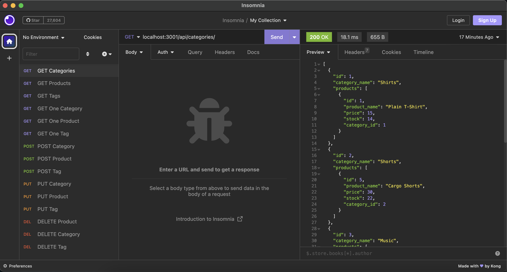
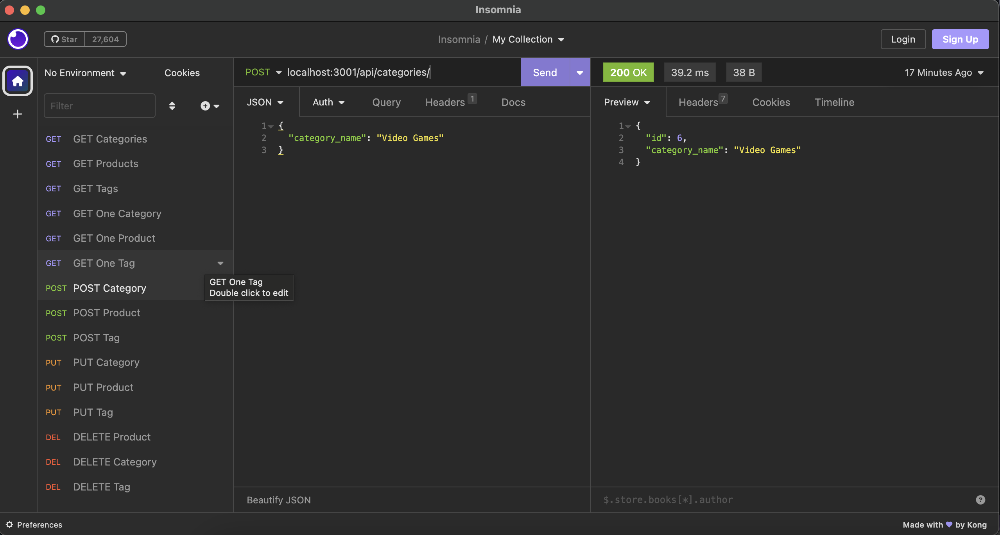
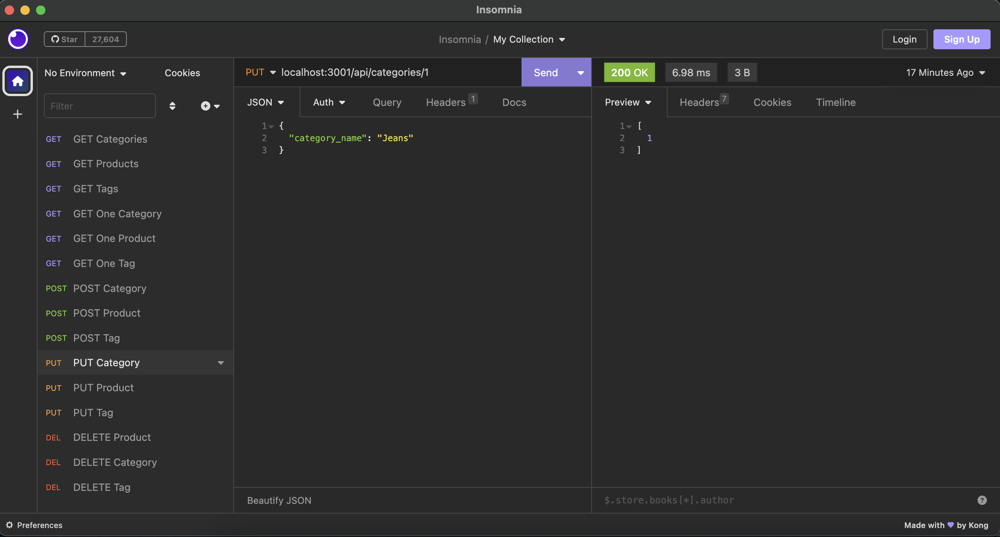
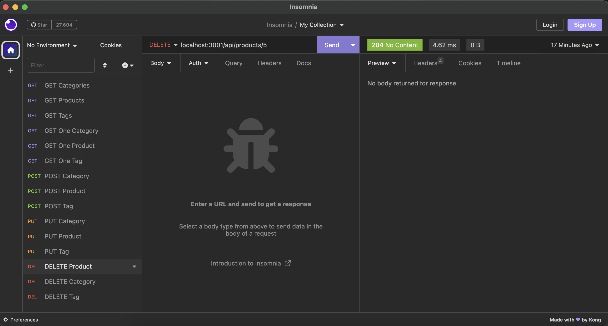

# E-Commerce

## Description

Back end of an e-commerce site that allows a user to view, update, and delete data.

## Installation

1. Install [Node.js](https://nodejs.org/en).
2. Clone or fork the [repo](https://github.com/scelsic2/ecommerce).
3. Open the repo with VS Code.
4. Open an integrated terminal in the repo folder.
5. In the terminal, run `npm init`.
6. In the terminal, run `npm install dotenv`.
7. In the terminal, run `npm install express`.
8. In the terminal, run `npm install mysql2`.
9. In the terminal, run `npm install sequelize`.
10. In the terminal, run `npm install nodemon`.
11. Use the `schema.sql` file in the `db` folder to create the database in the MySQL shell.
12. Seed the database with `npm run seed`.
13. Start the server with `npm run watch`.

## Usage

Retrieve all categories, products, or tags or a select category, product, or tag.

Add a new category, product, or tag. 

Update a category, product, or tag.

Delete a category, product, or tag.

## Credits
- https://github.com/jpd61/e-commerce-backend/blob/master/routes/api/category-routes.js
- https://www.youtube.com/watch?v=HiK3-KFTWKw
- Tutoring 16APR2023

## License
MIT License

## Video Walkthrough

https://drive.google.com/file/d/1WZA9DzuiC2HhTj0FzMjWFxzdH579U69X/view?usp=sharing

